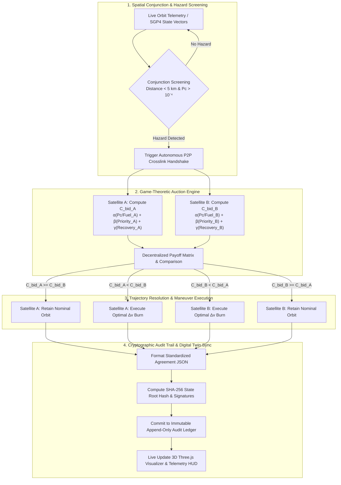

# 🛰️ Orbital Negotiator (ONP v4.1)

> **Autonomous Low Earth Orbit (LEO) Space Traffic Management via Game-Theoretic Bidding, Adaptive Escalation & Cryptographic Audit Trails.**

[](https://orbital-negotiator.vercel.app)


**🌐 Live Deployment:** [https://orbital-negotiator.vercel.app](https://orbital-negotiator.vercel.app)

---

## 🌌 The Problem: Low Earth Orbit is Running Out of Room

As Low Earth Orbit (LEO) expands toward **60,000+ active satellites by 2030**, traditional ground-station conjunction coordination (taking 4 to 8 hours of human telemetry relays and email coordination) becomes a fatal bottleneck for orbital safety. At closing velocities up to **54,000 km/h (15 km/s)**, delays lead directly to catastrophic collisions (Kessler Syndrome).

```
       TODAY'S MANUAL PARADOX                         ORBITAL NEGOTIATOR'S APPROACH
┌──────────────────────────────────────┐       ┌──────────────────────────────────────┐
│ • Radar detects conjunction on Earth │       │ • Satellites evaluate risk locally   │
│ • Ground teams email each other      │  vs   │ • Algorithmic, zero-human bidding    │
│ • Hours/days of human latency        │       │ • Microsecond deterministic resolve  │
│ • Secret fuel data cannot be shared  │       │ • Zero-Knowledge verifiable ledger   │
└──────────────────────────────────────┘       └──────────────────────────────────────┘
```

* **The Communication Lag:** Satellite operators rely on ground stations that spacecraft only pass over once every 45 to 90 minutes. If an emergency conjunction arises 30 minutes before closest approach, commands cannot reach the satellite in time.
* **The Coordination Bottleneck:** SpaceX Starlink alone executes **over 140 avoidance maneuvers every day** (50,000+ burns every 6 months). Ground teams cannot scale to handle millions of daily warning alerts manually.
* **The Secret Telemetry Dilemma:** Commercial operators and defense satellites refuse to reveal confidential propellant reserves or classified mission priorities to competitors.

**Orbital Negotiator** solves this by turning collision avoidance into an autonomous, deterministic, privacy-preserving negotiation protocol.

---

## 🔄 Protocol Execution Workflow

The complete end-to-end execution lifecycle from conjunction detection to cryptographic audit commitment:



---

## 🧮 Mathematical Pricing & Right-of-Way Formulation

Right-of-way is evaluated autonomously over peer-to-peer Inter-Satellite Crosslinks (ISL) using a deterministic cost-minimization bidding function:

$$C_{\text{bid}} = \alpha \cdot \left(\frac{P_c \cdot 100}{\max(M_{\text{prop}}, 0.01)}\right) + \beta \cdot P_{\text{miss}} + \gamma \cdot T_{\text{recovery}}$$

### ⚙️ Protocol Parameters:
* **$\alpha = 1.2$ ($\Delta v$ Fuel Scarcity Penalty):** Prevents fuel-constrained satellites from early mission termination by forcing propellant-rich assets to yield.
* **$\beta = 0.8$ (Mission Criticality Weight):** Asserts right-of-way for strategic, crewed, or high-value defense missions.
* **$\gamma = 0.5$ (Recovery Downtime Weight):** Minimizes constellation disruption and payload thermal recovery time.

### ⚖️ The Equilibrium Rule:
* **Winning Spacecraft (Higher $C_{\text{bid}}$):** Preserves its nominal trajectory without burning propellant.
* **Yielding Spacecraft (Lower $C_{\text{bid}}$):** Executes an orthogonal, fuel-optimal Collision Avoidance Maneuver (CAM).

---

## ⚡ Adaptive Multi-Tier Escalation Architecture

Orbital Negotiator automatically derives safety thresholds based on live telemetry context while keeping them operator-tunable:

| Escalation Tier | Trigger Criteria | Autonomous Action Protocol |
| :--- | :--- | :--- |
| **Tier 1: Nominal** | $P_c < 0.35$ &middot; Miss Dist $> 3\text{ km}$ | Passive SGP4 tracking, background ISL sync |
| **Tier 2: Urgent** | $P_c \ge 0.38$ or Fuel $< 18\%$ | Fast-track 1-round bidding with priority weight boost |
| **Tier 3: Emergency** | $P_c \ge 0.65$ or Simultaneous Cluster | Unilateral cross-track burst ($1.8\times$ thrust), $P_c \to 0\%$ |

---

## 🚨 Emergency Collision Scenarios

* **Simultaneous Multi-Satellite Cascade Conjunction:** Resolves 6-satellite convergent cluster collisions via concurrent pairwise auctions without circular yield deadlocks.
* **Solar Radiation Storm (CME):** Fleet-wide Tier 3 emergency escalation with geomagnetic navigation compensation.
* **Hyper-Velocity Debris Swarm:** Rapid $1.8\times$ cross-track thrust bursts to evacuate orbital shells.
* **Crewed / Strategic Defense Insertion:** Maximum priority asserting right-of-way across all intersecting planes.

---

## 📋 Comprehensive Reporting & Export Formats

* **📄 Microsoft Word (`.doc`) Systematic Audit Report:** Formatted aerospace audit with mathematical formulas, executive summaries, full 20-satellite telemetry tables, and chronological maneuver history.
* **📥 Cryptographic Ledger (`.json`):** Machine-readable JSON export with SHA-256 state roots, sequence IDs, and verification flags.
* **🚨 Emergency Incident Report (`.json`):** Instant post-incident reports accessible during and after emergency situations.

---

## ✨ Key Features

* **🎮 Interactive 3D Digital Twin:** Real-time WebGL Earth simulation built with Three.js, featuring procedural Day/Night shaders, metropolitan city lights, and specular ocean reflections.
* **🛰️ Real-Time Telemetry & Tracking:** Live tracking of orbital parameters (Inclination, RAAN, Semi-Major Axis, Altitude, Latitude, Longitude, Phase).
* **🚨 Conjunction Warning Beams:** Dynamic pulsing visual vectors connecting satellites entering close-approach horizons.
* **⚡ Deterministic Microsecond Latency:** Zero-LLM, pure mathematical evaluation guaranteeing reproducible, instant decisions.
* **📜 Live Cryptographic Audit Ledger:** Real-time stream of signed transaction receipts and SHA-256 verification hashes.
* **⏱️ Simulation Time-Warp:** Variable playback speed ($1\times \to 5\times$), orbit trail toggles, predictive path visualizers, and satellite camera locks.
* **📚 Complete Documentation Suite:** Built-in Whitepaper, Bidding Engine breakdown, Zero-Knowledge Proof (ZKP) specs, SGP4 references, and Trajectory API docs.

---

## 📁 Repository Structure

```
orbital_negotiator/
├── index.html                  # HTML entry point
├── package.json                # Project dependencies and build scripts
├── tsconfig.json               # TypeScript configuration
├── vite.config.js              # Vite configuration with Tailwind integration
├── vercel.json                 # Vercel SPA routing and deployment configuration
├── public/                     # Static assets and textures
└── src/
    ├── App.jsx                 # Top-level view router (Landing vs. Simulator)
    ├── App.css                 # Global styling rules
    ├── index.css               # Tailwind CSS imports & theme variables
    ├── ProductLanding.jsx      # Interactive product landing page with scroll animations
    ├── OrbitalNegotiator.jsx   # Core 3D orbital visualizer, physics loop & HUD
    ├── OrbitalModel.jsx        # Modular 3D Three.js canvas & satellite mesh engine
    ├── Hero.jsx                # WebGL custom background shader
    ├── components/
    │   └── ui/
    │       └── rotating-earth.jsx # Procedural 3D Earth canvas component
    └── pages/
        ├── PageLayout.jsx      # Documentation layout wrapper
        ├── Whitepaper.jsx      # Scientific and architectural whitepaper
        ├── BiddingEngine.jsx   # Detailed Game-Theoretic math & formulas
        ├── ZKPLedger.jsx       # Zero-Knowledge audit ledger specifications
        ├── SGP4Reference.jsx   # Astrodynamics & SGP4 coordinate references
        ├── TrajectoryAPI.jsx   # REST/WebSocket API endpoints & schema
        ├── AuditReports.jsx    # Regulatory compliance report generator
        └── Developers.jsx      # Developer integration guide & SDK notes
```

---

## 🚀 Quickstart & Local Setup

### Prerequisites
* **Node.js**: v18.0.0 or higher
* **npm** or **yarn** / **pnpm**

### Installation

1. **Clone the repository:**
   ```bash
   git clone https://github.com/aayushbamal/orbital_negotiator.git
   cd orbital_negotiator
   ```

2. **Install dependencies:**
   ```bash
   npm install
   ```

3. **Start the local development server:**
   ```bash
   npm run dev
   ```

4. **Open in your browser:**
   Navigate to [http://localhost:3000](http://localhost:3000) or [http://localhost:5173](http://localhost:5173) to explore the interactive landing page and live 3D orbital simulator.

5. **Build for production:**
   ```bash
   npm run build
   npm run preview
   ```

---

## 🛠️ Technology Stack

| Layer | Technology | Purpose |
|---|---|---|
| **Frontend Framework** | React 19 + Vite 8 | Ultra-fast build toolchain & component architecture |
| **3D Graphics** | Three.js + WebGL | High-performance orbital scene, procedural textures & particle trails |
| **Styling & UI** | TailwindCSS 4 + Radix UI + Lucide | Futuristic dark-space glassmorphism UI & responsive typography |
| **Animation** | Framer Motion | Smooth phase transitions and scroll animations |
| **Cryptography** | Web Crypto API (`crypto.subtle`) | Client-side SHA-256 state hashing and verifiable receipts |
| **Astrodynamics (Ext)** | `satellite.js` / SGP4 | Keplerian & SGP4 coordinate transformations |
| **Deployment** | Vercel | Production static web distribution & continuous deployment |

---

## 🗺️ Roadmap & Industrial Vision

- [x] Interactive 3D Three.js orbital digital twin with procedural Earth rendering.
- [x] Deterministic game-theoretic cost-to-maneuver ($C_{\text{bid}}$) negotiation engine.
- [x] Live SHA-256 cryptographic audit ledger stream & report downloads.
- [ ] **Live SGP4 & CelesTrak Ingestion:** Stream 10,000+ active satellites directly from Space-Track/CelesTrak.
- [ ] **Zero-Knowledge Circuits (zk-SNARKs):** Circom/SnarkJS circuits to verify bids without revealing confidential fuel/mission data.
- [ ] **CCSDS OCM/CDM Export:** Export standardized JSON/XML compliance packages for FAA, Space Force, and ESA regulators.
- [ ] **VCG Mechanism & Credit Exchange:** Automated economic settlement and propellant compensation between operators.

---

## 📄 License

This project is licensed under the **MIT License** — see the [LICENSE](LICENSE) file for details.

---

<p align="center">
  Built with 🛰️ for the future of sustainable space exploration and autonomous traffic management.
</p>
